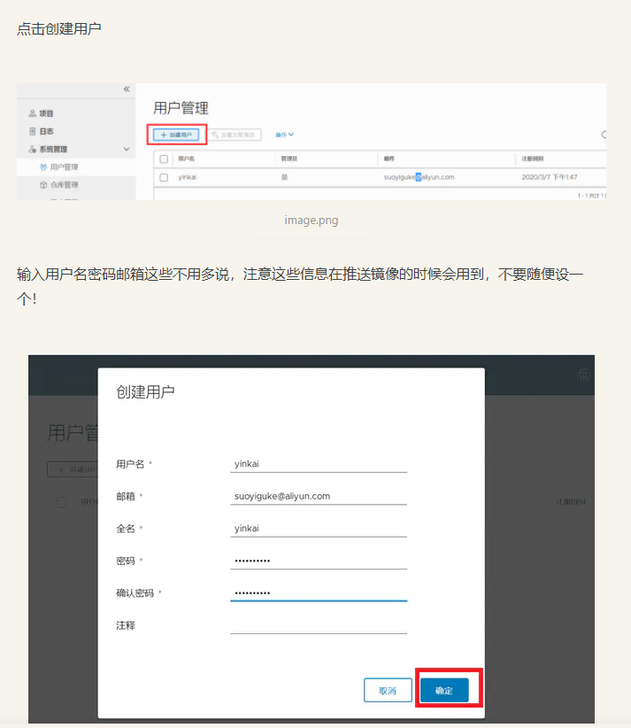

## 前置准备

一台master节点服务器  （公网ip：124.71.96.154  内网ip：192.168.0.166）

---可用端口： 30080（Kuboard）、30188（Jenkins）、9103（Harbor）

服务：k8s、docker、jenkins、harbor、kuboard

全局环境：jdk+maven、git、nodejs+npm

host：192.168.0.166 harborserver


一台或多台worker节点服务器 （公网ip：116.205.131.49  内网ip：192.168.0.128）

---可用端口： 80

服务：k8s、docker

host：192.168.0.166 harborserver


外部访问配置hosts：

116.205.131.49 jenkins.tech.hxcapital.cn
116.205.131.49 harbor.tech.hxcapital.cn
116.205.131.49 nexus3.tech.hxcapital.cn
116.205.131.49 nacos.tech.hxcapital.cn
116.205.131.49 kuboard.tech.hxcapital.cn
116.205.131.49 grafana.tech.hxcapital.cn
116.205.131.49 oms.test.hxcapital.cn
116.205.131.49 oms.test1.hxcapital.cn
116.205.131.49 oms.test2.hxcapital.cn
116.205.131.49 oms.api.test.hxcapital.cn
116.205.131.49 oms.api.test1.hxcapital.cn
116.205.131.49 oms.api.test2.hxcapital.cn


##  K8S集群

master节点主机ip:192.168.0.101

worker节点主机ip:192.168.0.102

### 1、安装 k8s

```bash
# 所有节点

# 将docker镜像源地址临时暴露到系统全局
export REGISTRY_MIRROR=https://registry.cn-hangzhou.aliyuncs.com

# 安装kubelet
curl -sSL https://kuboard.cn/install-script/v1.21.x/install_kubelet.sh | sh -s 1.21.2

kubelet --version
# v1.21.2
```

### 2、安装docker

```bash
# 所有节点

# 使用第一步的阿里云镜像源安装docker
curl -fsSL https://get.docker.com | bash -s docker --mirror Aliyun

# 启动docker服务
systemctl start docker

# 设置docker开启自启
systemctl enable docker

# 查看docker版本
docker version
# 20.10.8

# 查看docker引擎工作状态
systemctl status docker
```

### 3、docker 配置

```bash
#所有节点（worker可以不配置镜像加速）
#加速镜像
#镜像存储位置
#docker日志


# 创建一个docker数据存储文件夹
mkdir /opt/data/docker -p
vim  /etc/docker/daemon.json

# max-size设置日志文件的最大容量，max-file设置文件句柄的最大打开个数，graph设置挂载数据的物理机目录路径
{
  "registry-mirrors": ["https://rnysp4y7.mirror.aliyuncs.com"],
  "insecure-registries":["harborserver:9103","harborserver:9103"],
  "graph":"/opt/data/docker",
  "log-driver":"json-file",
  "log-opts": {"max-size":"200m", "max-file":"3"}
}

# 重启docker使配置文件生效
systemctl restart docker

# 查看docker相关配置信息，验证刚刚的配置文件是否生效
docker info

# 查看硬盘使用情况
df -h
```

### 4、初始化 master 节点

在准备作为master节点的服务器上

```bash
# 查看网卡ip地址
ip address

# 全局暴露master主机的ip（内网ip）
export MASTER_IP=192.168.0.101

# Kubernetes 容器组所在的网段，该网段安装完成后，由 kubernetes 创建，事先并不存在于您的物理网络中，后续被Kubernetes的容器网络使用
export POD_SUBNET=10.100.0.0/16

# 替换 apiserver.demo 为 您想要的 dnsName
export APISERVER_NAME=k8smaster

# 将变量写入host文件
echo "${MASTER_IP}    ${APISERVER_NAME}" >> /etc/hosts

# 初始化master节点
curl -sSL https://kuboard.cn/install-script/v1.21.x/init_master.sh | sh -s 1.21.2 /coredns
```

### 5、设置master网络

master节点

```bash

# calico作为网络插件
# kubectl apply -f https://kuboard.cn/install-script/v1.21.x/calico-operator.yaml 

# 获取flannel网络插件配置文件
wget https://kuboard.cn/install-script/flannel/flannel-v0.14.0.yaml

# sed命令将flannel-v0.14.0.yaml文件中默认的k8s容器组网段10.244.0.0/16替换为10.100.0.0/16
sed -i "s#10.244.0.0/16#${POD_SUBNET}#" flannel-v0.14.0.yaml

# Kubernetes应用flannel
kubectl apply -f ./flannel-v0.14.0.yaml
```

### 6、查看master节点

```bash
# 等待readyed
kubectl get node

kubectl get pod -n kube-system
```

### 7、设置nodeport（k8s中的端口开放）

master节点

```bash
# https://kuboard.cn/install/install-node-port-range.html

# k8s端口组开放
vim /etc/kubernetes/manifests/kube-apiserver.yaml

###############################
#kube-apiserver.yaml
spec:
  containers:
  - command:
    - kube-apiserver
+   - --service-node-port-range=1-32726
###############################
```

### 8、重启apiserver

master节点

```bash
# 获得 apiserver 的 pod 名字
export apiserver_pods=$(kubectl get pods --selector=component=kube-apiserver -n kube-system --output=jsonpath={.items..metadata.name})

# 删除 apiserver 的 pod
kubectl delete pod $apiserver_pods -n kube-system
```

#### 验证结果

```bash
kubectl describe pod $apiserver_pods -n kube-system

###############################
spec:
  containers:
  - command:
    - kube-apiserver
    - --service-node-port-range=1-32726
###############################
# 此时为成功
```

### 9、将子节点加入集群

在master节点的服务器上

```bash
kubeadm token create --print-join-command
# kubeadm join k8smaster:6443 --token mpfjma.4vjjg8flqihor4vt     --discovery-token-ca-cert-hash sha256:6f7a8e40a810323672de5eee6f4d19aa2dbdb38411845a1bf5dd63485c43d303
```

在准备作为worker节点的服务器上

```bash
# 全局暴露master主机的ip（内网ip）
export MASTER_IP=192.168.0.101

# 替换 apiserver.demo 为 您想要的 dnsName
export APISERVER_NAME=k8smaster

# 将变量写入host文件
echo "${MASTER_IP}    ${APISERVER_NAME}" >> /etc/hosts

# 子节点加入集群
kubeadm join k8smaster:6443 --token mpfjma.4vjjg8flqihor4vt     --discovery-token-ca-cert-hash sha256:6f7a8e40a810323672de5eee6f4d19aa2dbdb38411845a1bf5dd63485c43d303
```
在master节点上

```bash
# 等待readyed，此时应当有两个节点，一个为master一个为worker
kubectl get nodes

# 可选
systemctl daemon-reload
systemctl restart kubelet

# node noready的解决方案
https://blog.csdn.net/xiaohuixing16134/article/details/102784269
```

### 10、安装ingress-nginx反向代理插件

#### 创建ingress工作目录（可选）

```bash
mkdir -p /opt/k8s/ingress
  
cd /opt/k8s/ingress
```

```bash
  
# 获取两个用于ingress反向代理的配置文件
wget https://raw.githubusercontent.com/kubernetes/ingress-nginx/nginx-0.30.0/deploy/static/provider/baremetal/service-nodeport.yaml
wget https://raw.githubusercontent.com/kubernetes/ingress-nginx/nginx-0.30.0/deploy/static/mandatory.yaml

# 获取ingress镜像
docker pull suisrc/ingress-nginx:0.30.0
```

#### 修改配置文件

```yaml
# service-nodeport.yaml
apiVersion: v1
kind: Service
metadata:
  name: ingress-nginx
  namespace: ingress-nginx
  labels:
    app.kubernetes.io/name: ingress-nginx
    app.kubernetes.io/part-of: ingress-nginx
spec:
  type: NodePort
  ports:
    - name: http
      port: 80
      targetPort: 80
      protocol: TCP
+     nodePort: 80
-   - name: https
-     port: 443
-     targetPort: 443
-     protocol: TCP
  selector:
    app.kubernetes.io/name: ingress-nginx
    app.kubernetes.io/part-of: ingress-nginx

---
```

```yaml
# mandatory.yaml 片段
apiVersion: apps/v1
kind: Deployment
metadata:
  name: nginx-ingress-controller
  namespace: ingress-nginx
  labels:
    app.kubernetes.io/name: ingress-nginx
    app.kubernetes.io/part-of: ingress-nginx
spec:
- replicas: 1
+ replicas: 2
  selector:
    matchLabels:
      app.kubernetes.io/name: ingress-nginx
      app.kubernetes.io/part-of: ingress-nginx
  template:
    metadata:
      labels:
        app.kubernetes.io/name: ingress-nginx
        app.kubernetes.io/part-of: ingress-nginx
      annotations:
        prometheus.io/port: "10254"
        prometheus.io/scrape: "true"
    -spec:
      # wait up to five minutes for the drain of connections
      terminationGracePeriodSeconds: 300
      serviceAccountName: nginx-ingress-serviceaccount
      nodeSelector:
        kubernetes.io/os: linux
      containers:
        - name: nginx-ingress-controller
_         image: quay.io/kubernetes-ingress-controller/nginx-ingress-controller:0.30.0
+         image: suisrc/ingress-nginx:0.30.0

```


```bash
# 将修改好的配置文件应用到k8s中创建服务
kubectl apply -f mandatory.yaml
kubectl apply -f service-nodeport.yaml

# 查看
kubectl get all -n ingress-nginx
kubectl get pod -n ingress-nginx -o wide
kubectl get deploy -n ingress-nginx -o wide
kubectl get svc -n ingress-nginx -o wide

# 查看pod是否亲和
kubectl delete service ingress-nginx -n ingress-nginx
kubectl delete deploy  nginx-ingress-controller -n ingress-nginx
```

#### 配置反向代理

```bash
vim ingress-http-default.yaml
```

```yaml
# ingress-http-default.yaml
apiVersion: extensions/v1beta1
kind: Ingress
metadata:
  name: ingress-http
  namespace: test
spec:
  rules:
  - host: oms.test.hxcapital.cn
    http:
      paths:
      - path: /
        backend:
          serviceName: oms-web-test-service
          servicePort: 80
  # 所有微服务pod在worker节点启动，网关service对k8s暴露9500端口，经过ingress反向代理，访问oms.api.test.hxcapital.cn（116.205.131.49:80）相当于访问test命名空间中的oms-gateway-test-service服务，通过gateway访问其它微服务由springcloud实现
  - host: oms.api.test.hxcapital.cn 
    http:
      paths:
      - path: /
        backend:
          serviceName: oms-gateway-test-service
          servicePort: 9500                 
          
---

apiVersion: extensions/v1beta1
kind: Ingress
metadata:
  name: ingress-http
  namespace: test1
spec:
  rules:
  - host: oms.test1.hxcapital.cn
    http:
      paths:
      - path: /
        backend:
          serviceName: oms-web-test-service
          servicePort: 80
  - host: oms.api.test1.hxcapital.cn
    http:
      paths:
      - path: /
        backend:
          serviceName: oms-gateway-test-service
          servicePort: 9500
          
---

apiVersion: extensions/v1beta1
kind: Ingress
metadata:
  name: ingress-http
  namespace: test2
spec:
  rules:
  - host: oms.test2.hxcapital.cn
    http:
      paths:
      - path: /
        backend:
          serviceName: oms-web-test-service
          servicePort: 80
  - host: oms.api.test2.hxcapital.cn
    http:
      paths:
      - path: /
        backend:
          serviceName: oms-gateway-test-service
          servicePort: 9500
```

```bash
kubectl apply -f ingress-http-default.yaml
kubectl get ing ingress-http -n default
kubectl describe ing ingress-http  -n default # ！查看ingress反向代理的详细信息
```

### 11、常用命令

#### 其它

```bash
kubectl apply -f xxxx.yaml

# kubectl命令帮助文档 -h参数
# 查看kubectl所有操作
kubectl -h/kubectl --help

# 查看create命令的所有option
kubectl create -h
....
```

#### 创建

```bash
# 参数
--image # 镜像
--replicas # 副本
# 创建一个命名空间（命名空间用于隔离资源[service、deployment、pod]）
kubectl create ns ${namespace} 

# 创建一个pod容器(拉取一个容器镜像并运行容器)
kubectl run ${pod_name} --image ${image_name}

# 创建一个deployment控制器并指定副本
kubectl run ${deploy_name} --image ${image_name} --
```

#### 删除

```bash
# 删除指定命名空间下的所有资源 
kubectl delete all --all -n ${namespace}

# 删除指定容器
kubectl delete pod ${pod_name}/${pod_id}

# 删除指定deployment
kubectl delete deploy ${deploy_name}/${deploy_id}

# 删除指定service
kubectl delete svc ${service_name}/${service_id}

# 使用配置文件删除资源
kubectl delete -f xxxx.yaml
```

#### 查看

```bash
# 参数
-owide # 拓展信息
-A # 全部命名空间资源
-n # 指定命名空间

kubectl get pod [${pod_name}] -owide -n ${namespace}
kubectl get deploy [${deploy_name}] -owide -n ${namespace}
kubectl get svc [${service_name}] -owide  -n ${namespace}

# 访问容器服务
curl ${pod_ip}:${pod_port}

# 进入pod容器
kubectl exec -it ${pod_name} -n ${namespace} -- /bin/sh
```

## 项目集成

### oms-web

1. 在项目git仓库中新增test1、test2分支

2. 在项目根目录新增oms-test1.yml、oms-test2.yml、.env.test1、.env.test2

```yaml
# .env.test1

# just a flag
NODE_ENV = 'production'
VUE_APP_CURRENTMODE='test1'

# base api
VUE_APP_BASE_API = 'http://oms.api.test1.hxcapital.cn/oms'

# user模块
VUE_APP_BASE_API2 = 'http://oms.api.test1.hxcapital.cn/oms/user'

# search模块
VUE_APP_BASE_API3 = 'http://oms.api.test1.hxcapital.cn/oms/search'

# monitor模块
VUE_APP_BASE_API4 = 'http://oms.api.test1.hxcapital.cn/oms/monitor'

# news模块
VUE_APP_BASE_API5 = 'http://oms.api.test1.hxcapital.cn/oms/news'

# reports模块
VUE_APP_BASE_API6 = 'http://oms.api.test1.hxcapital.cn/oms/report'
```

```yaml
# .env.test2

# just a flag
NODE_ENV = 'production'
VUE_APP_CURRENTMODE='test2'

# base api
VUE_APP_BASE_API = 'http://oms.api.test2.hxcapital.cn/oms'

# user模块
VUE_APP_BASE_API2 = 'http://oms.api.test2.hxcapital.cn/oms/user'

# search模块
VUE_APP_BASE_API3 = 'http://oms.api.test2.hxcapital.cn/oms/search'

# monitor模块
VUE_APP_BASE_API4 = 'http://oms.api.test2.hxcapital.cn/oms/monitor'

# news模块
VUE_APP_BASE_API5 = 'http://oms.api.test2.hxcapital.cn/oms/news'

# reports模块
VUE_APP_BASE_API6 = 'http://oms.api.test2.hxcapital.cn/oms/report'
```

```yml
# oms-test1

apiVersion: apps/v1
kind: Deployment
metadata:
  name: oms-web-test-deployment
  namespace: test1
spec:
  replicas: 2
  selector:
    matchLabels:
      app: oms-web-test-pod
  template:
    metadata:
      labels:
        app: oms-web-test-pod
    spec:
      imagePullSecrets:
        - name: docker-harbor-test1
      containers:
        - name: oms-web-test
          image: harborserver:9103/huaixin/oms-web-test1:latest
          imagePullPolicy: Always
          ports:
            - containerPort: 80
          env:
            - name: spring.profiles.active
              value: test1

---

apiVersion: v1
kind: Service
metadata:
  name: oms-web-test-service
  namespace: test1
spec:
  selector:
    app: oms-web-test-pod
  ports:
    - port: 80
      targetPort: 80
  clusterIP: None
  type: ClusterIP

```

```yml
# oms-test2.yml

apiVersion: apps/v1
kind: Deployment
metadata:
  name: oms-web-test-deployment
  namespace: test2
spec:
  replicas: 2
  selector:
    matchLabels:
      app: oms-web-test-pod
  template:
    metadata:
      labels:
        app: oms-web-test-pod
    spec:
      imagePullSecrets:
        - name: docker-harbor-test2
      containers:
        - name: oms-web-test
          image: harborserver:9103/huaixin/oms-web-test2:latest
          imagePullPolicy: Always
          ports:
            - containerPort: 80
          env:
            - name: spring.profiles.active
              value: test2

---

apiVersion: v1
kind: Service
metadata:
  name: oms-web-test-service
  namespace: test2
spec:
  selector:
    app: oms-web-test-pod
  ports:
    - port: 80
      targetPort: 80
  clusterIP: None
  type: ClusterIP

```

### oms-java

1. 在项目git仓库中新增test1、test2分支

2. 在除了公共模块（common、api）和网关模块（gateway）外每个maven子项目根目录新增oms-test1.yml、oms-test2.yml（targetPort、containerPort、port全部与application.yml的输出port对应）

```yml
# oms-test1.yml
apiVersion: apps/v1
kind: Deployment
metadata:
  name: oms-monitor-test-deployment
  namespace: test1
spec:
  replicas: 2
  selector:
    matchLabels:
      app: oms-monitor-test-pod
  template:
    metadata:
      labels:
        app: oms-monitor-test-pod
    spec:
      imagePullSecrets:
        - name: docker-harbor-test1
      containers:
        - name: oms-monitor-test
          image: harborserver:9103/huaixin/oms-monitor-test1:latest
          imagePullPolicy: Always
          ports:
            - containerPort: 9543
          env:
            - name: spring.profiles.active
              value: test1
            - name: JAVA_TOOL_OPTIONS
              value: -Xmx128m -Xms128m


---

apiVersion: v1
kind: Service
metadata:
  name: oms-monitor-test-service
  namespace: test1
spec:
  selector:
    app: oms-monitor-test-pod
  ports:
    - port: 9543
      targetPort: 9543
  type: ClusterIP
  clusterIP: None
```

3. 在每个maven子项目resources目录新增application- test1.yml、application- test2.yml

## Jenkins

### 安装

https://pkg.jenkins.io/redhat-stable/

### 启动

`使用war ，进程是 root 权限 ，比较危险 ，但是比较方便`

```bash
nohup java -jar /usr/lib/jenkins/jenkins.war --httpPort=30188 > jenkins.file 2>&1 &
```

### 初始化

#### 解锁

首次访问http://jenkins.tech.hxcapital.cn:30188/，根据浏览器提示进行操作。


#### 插件

安装推荐的插件

无法连接到，多试几次


#### 重启

##### 修改配置重启

```bash
# 在jenkins.file文件所在目录下

# 查看端口占用
netstat -lnp|grep 30188

# 杀死进程
kill -9 PID

# 指定配置启动jenkins
nohup java -jar /usr/lib/jenkins/jenkins.war --httpPort=30188 > jenkins.file 2>&1 &
```

##### 不修改配置重启

http://jenkins.tech.hxcapital.cn:30188/restart

### 使用

需要安装**Date Parameters插件**，该插件可实现实时获取一个系统时间变量，我们用来给镜像打上标签以区分镜像，避免造成同名镜像覆盖

需要在**系统设置**中设置job队列最大并发数（可选）

需要在**构建配置**中设置好最大构建历史记录数和构建历史保留天数（可选）

对于写在pipeline中的参数，**应用配置之后**需要**重新执行一次job构建**参数视图才会出现

对于普通账号，应当只开放job的read和build权限

jenkins在job构建时会在/root/.jenkins/workspace创建一个工作目录（目录名称就是job的名称），所有的构建工作都在这里进行，如果中途暂停构建，会建立一个@temp目录，恢复构建时继续执行

#### pipeline

##### oms-web-test

```yml
pipeline {
    agent any
    parameters {
        string(name: 'branch', defaultValue: 'test', description: '分支')
        choice(name: 'env', choices: ['test', 'test1', 'test2'], description: '环境')
    }
    stages{
        stage('拉取代码') {
            steps{
            	git branch: '${branch}', credentialsId: '534664357', url: 'https://e.coding.net/huaixin/companyvoice/web.git'
            }
        }
        stage('安装依赖'){
            steps{
            	sh 'npm install'
            }
        }
        stage('打包编译'){
            steps{
                sh 'npm run build:${env}'
            }
        } 
        stage('镜像制作'){
            steps{
                echo '使用dockerfile构建镜像'
            	sh 'docker build -t harborserver:9103/huaixin/oms-web-${env}:${version} .'
            	echo '将镜像上传至harbor仓库'
            	sh 'docker push harborserver:9103/huaixin/oms-web-${env}:${version}'
            }
        }
        stage('集群部署'){
            steps{
                echo '配置替换'
                sh 'sed -i s/latest/${version}/g oms-${env}.yml'
                echo '生成应用'
                sh 'kubectl apply -f oms-${env}.yml'
            }
        } 
        
   }
}
```

##### oms-java-test

```yml
pipeline {
    agent any
    parameters {
        string(name: 'branch', defaultValue: 'test', description: '分支')
        choice(name: 'module', choices: ['oms-search', 'oms-news', 'oms-monitor','oms-user','oms-gateway','oms-report','oms-supervise','oms-wechat'], description: '模块')
        choice(name: 'env', choices: ['test', 'test1', 'test2'], description: '环境')
    }
    stages {
        stage('拉取代码') {
            steps{
                git branch: '${branch}', credentialsId: '534664357', url: 'https://e.coding.net/huaixin/oms/oms.git'
                echo '代码拉取成功'
            }
        }
        stage('打包构建公用模块') {
            steps{
                sh '''
                    cd oms-common
                    mvn clean install -Dmaven.test.skip=true
                    cd ../oms-api
                    mvn clean install -Dmaven.test.skip=true
                    cd ../
                '''
                echo '公用模块构建完成'
            }
        }
        stage('打包构建指定模块') {
            steps{
                sh '''
                    cd ${module}
                    mvn clean install -Dmaven.test.skip=true
                '''
                echo '指定模块构建完成'
            }
        }
        stage('镜像制作') {
            steps {
                sh'''
                    cd ${module}
                    docker build -t harborserver:9103/huaixin/${module}-${env}:${version} .
                    docker push  harborserver:9103/huaixin/${module}-${env}:${version}
                    echo '镜像制作完成'
                '''
            }
        }
        stage('集群部署') {
            steps {
                sh'''
                    cd ${module}
                    pwd
                    sed -i s/latest/${version}/g oms-${env}.yml
                    echo '配置替换完成'
                    kubectl apply -f oms-${env}.yml
                    echo '集群部署完成'
                '''
            }
        }
    }
}
```

### 权限管理

1. 安装插件role-strategy

2. 启用角色管理插件

   Manage Jenkins -> Configure Global Security 选择 Role-Based Strategy 

   

   

3. 角色管理

   Manage Jenkins -> Configure Global Security -> Manage and Assign Roles

   

   Item roles  (.*)-test 表示匹配所有-test的job，并且对于这些job只有Build和Read权限

4. 新增用户

   .png)

5. 用户角色分配

   .png)

## Harbor私服

### 安装

1. 安装docker-compose

   ```bash
   curl -L https://get.daocloud.io/docker/compose/releases/download/1.28.5/docker-compose-`uname -s`-`uname -m` > /usr/local/bin/docker-compose
   ```

   

2. 开放docker-compose访问权限

   ```bash
   chmod +x /usr/local/bin/docker-compose
   ```

3. 查看docker-compose版本

   ```bash
   docker-compose --version
   ```

   

4. 在工作机上下载harbor软件压缩包并上传至master服务器

   [https://storage.googleapis.com/harbor-releases/release-1.9.0/harbor-offline-installer-v1.9.0.tgz](https://links.jianshu.com/go?to=https://storage.googleapis.com/harbor-releases/release-1.9.0/harbor-offline-installer-v1.9.0.tgz)

5. 将harbor软件压缩包解压至指定目录

   ```bash
   tar -xf harbor-offline-installer-v1.10.1.tgz -C /usr/local/
   ```

6. 进入harbor包目录修改配置文件

   ```bash
   vim harbor.yml
   ```
修改ip和端口

​       关闭https

​       修改管理员密码

​       修改数据和日志位置
   

   

   `需要注意的是hostname需要与docker的daemon.json中的host或ip保持一致`

7. 安装harbor

   ```bash
   ./prepare
   ./install.sh
   ```

8. 启动harbor

   ```bash
   docker-compose up -d 	#启动
   docker-compose stop 		#停止
   docker-compose restart 	#重新启动
   ```

### 权限管理

1. 创建用户

   

   `这里的用户信息实际上是docker的用户组，也对应了k8s的secret`

2. 创建项目


  公开项目docker可直接push和pull镜像，无需登录，在k8s内拉取镜像也无需配置secret

  私有项目docker需要login，k8s内拉取镜像需要配置secret（docker login）

3. 项目赋权

.png)


### 使用

#### 登录

```bash
# docker login -u ${username} -p ${password} ${remotehub_url}
docker login -u huaixin -p Test123456 harborserver:9103
```

#### 推送

```bash
docker tag nginx:latest harborserver:9103/huaixin/nginx:latest
docker push harborserver:9103/huaixin/nginx:latest
```

#### 拉取

```bash
docker pull harborserver:9103/huaixin/nginx:latest
```

## Kuboard

#### 参考

    https://kuboard.cn/install/v3/install-in-k8s.html#%E5%AE%89%E8%A3%85

#### 安装

    kubectl apply -f https://addons.kuboard.cn/kuboard/kuboard-v3.yaml

#### 测试

    watch kubectl get pods -n kuboard

#### 使用

```txt
http://kuboard.tech.hxcapital.cn:30080
输入初始用户名和密码，并登录
用户名： admin
密码： Kuboard123
```

## 硬件监控

暂无

## 注意事项

**harborserver是一个host名，harbor仓库服务搭建在master上，master负责镜像的push和pull，worker也有镜像的pull操作，因此控制节点和工作节点主机上的daemon.json文件都需要加上"insecure-registries":["harborserver:9103","harborserver:9103"]**

参考：https://developer.51cto.com/article/604342.html

#### harbor的私钥访问

https://kubernetes.io/zh/docs/tasks/configmap-secret/managing-secret-using-kubectl/

```bash
# 用户名密码邮箱需要与harbor账号（docker用户）对应，这里可以写成一个yml配置文件然后kubectl apply -f生成三个secret
kubectl create secret docker-registry docker-harbor-test --docker-server=harborserver:9103 --docker-username=huaixin --docker-password=Test123456 --docker-email=534664357@qq.com --namespace=test

kubectl create secret docker-registry docker-harbor-test1 --docker-server=harborserver:9103 --docker-username=huaixin --docker-password=Test123456 --docker-email=534664357@qq.com --namespace=test1

kubectl create secret docker-registry docker-harbor-test2 --docker-server=harborserver:9103 --docker-username=huaixin --docker-password=Test123456 --docker-email=534664357@qq.com --namespace=test2
```

